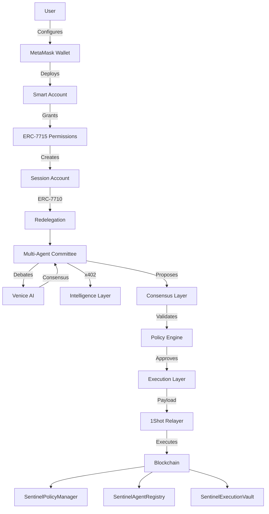
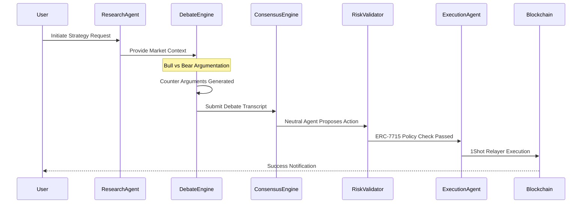

<h1 align="center">Sentinel AI</h1>

<p align="center">
  <strong>Autonomous AI Portfolio Manager powered by Multi-Agent Consensus, MetaMask Smart Accounts, ERC-7715 Permissions, ERC-7710 Delegation, x402 Payments, and 1Shot Relayer Infrastructure.</strong>
</p>

<p align="center">
  <a href="https://docs.google.com/presentation/d/1Cu2ED94fC9-hXvZVitRDpb99U_3ziv72W07DbeK9KxQ/edit?usp=sharing" target="_blank">Pitch Deck</a> •
  <a href="#live-demo">Live Demo</a> •
  <a href="https://youtu.be/SsjmK9SI6ao?si=ZCb1lBUF5swy4D7w" target="_blank">Video Demo</a> •
  <a href="#smart-contracts">Smart Contracts</a>
</p>

---

## Problem Statement

Modern crypto portfolio management suffers from several critical challenges:
* **Fragmented Tooling:** Users juggle multiple platforms for research, execution, and monitoring.
* **Manual Research:** Analyzing endless streams of news, onchain data, and tokenomics is exhausting.
* **Security Risks:** Directly exposing main wallet keys to trading platforms is dangerous.
* **Permission Management:** Granular control over what external entities can do is virtually nonexistent.
* **Constant Monitoring Requirements:** The 24/7 nature of crypto markets creates high cognitive load and burnout.

## Solution

**Sentinel AI** introduces an autonomous onchain investment committee. Instead of relying on a single fallible bot, Sentinel AI leverages a team of specialized AI agents that research, debate, validate, and execute investment decisions. Through MetaMask Smart Accounts and ERC-7715 permissions, users delegate scoped authority to this committee, allowing it to act on their behalf while strictly adhering to user-defined risk parameters and spending limits.

## Why Sentinel AI is the Need of the Hour

As the crypto market matures, the velocity and complexity of information are scaling exponentially:
1. **AI Agents are the New Users:** We are shifting from human-centric to agent-centric blockchains. The infrastructure to safely delegate funds to AI is required *today*.
2. **Defeating the "Single Point of AI Failure":** Large Language Models hallucinate. Trusting a single AI agent with your portfolio is financially reckless. Sentinel AI’s debate-and-consensus model is a necessary evolution to keep AI accountable.
3. **The Rise of Intent-Based Execution:** Users want outcomes (e.g., "maximize safe yield"), not the friction of gas tokens, bridging, and manual signing. Integrating 1Shot API abstracts away this friction, matching the UX expectations of Web2.
4. **Data Monopolization:** High-quality alpha is hidden behind paywalls. Sentinel AI’s use of x402 allows autonomous agents to stream micropayments for premium intelligence, leveling the playing field for retail investors.

## Why Sentinel AI is Different

Unlike existing solutions, Sentinel AI employs a **Multi-Agent Consensus** model:

| Feature | Traditional Trackers | Trading Bots | Copy Trading | Robo Advisors | Single-Agent AI | **Sentinel AI** |
| :--- | :--- | :--- | :--- | :--- | :--- | :--- |
| **Analysis Depth** | Manual | Technical only | Leader-dependent | Pre-set models | High but biased | **Multi-perspective Debate** |
| **Execution** | Manual | Automated | Automated | Automated | Automated | **Consensus-driven** |
| **Risk Control** | None | Stop-losses | Trust leader | Rigid | Variable | **ERC-7715 Scoped Permissions** |
| **Adaptability** | N/A | Low | Medium | Low | Medium | **High (Committee Intelligence)** |

A multi-agent committee is mathematically and practically superior because it removes single points of failure in reasoning. The Bull Agent pushes for growth, the Bear Agent demands risk mitigation, and the Neutral Agent synthesizes the optimal path.

---

## Hackathon Track Coverage

### Best Agent
Sentinel AI is not just one agent, but a cohesive committee of specialized intelligence:
* **Bull Agent:** Searches for upside potential, market catalysts, and momentum.
* **Bear Agent:** Identifies risks, bearish divergences, and fundamental flaws.
* **Yield Agent:** Analyzes DeFi protocols for the best risk-adjusted APYs.
* **Onchain Agent:** Monitors whale movements, smart money flows, and contract security.
* **Neutral Agent:** Synthesizes the debate and proposes the final action.
* **Execution Agent:** Formats transactions and interacts with the 1Shot Relayer.

### Best A2A Coordination
Our Agent-to-Agent (A2A) architecture is the core of Sentinel AI:
* **Structured Communication:** Agents communicate via a shared context window.
* **Debate Workflow:** Proposals are actively challenged by opposing agents.
* **Consensus Mechanism:** Actions are only taken when the Neutral Agent achieves committee consensus.
* **Decision Propagation:** Verified decisions are securely passed to the Execution Agent.
* **Redelegation Model:** Authority is seamlessly passed down the agent hierarchy securely.

### Best x402 + ERC-7710
We push the boundaries of smart accounts and machine economies:
* **Smart Accounts:** Built natively on MetaMask's advanced account abstractions.
* **ERC-7715 Permissions:** Users grant the committee strict spending and interaction limits.
* **ERC-7710 Delegation:** The primary controller delegates specific execution rights to session keys used by the Execution Agent.
* **Research Budget:** The committee has an autonomous sub-budget.
* **Autonomous Premium Data:** Agents use x402 to autonomously pay for paywalled APIs and premium intelligence reports needed for their debates.

### Best Use of 1Shot Permissionless Relayer
We completely abstract gas and transaction complexities:
* **Stablecoin Gas Payments:** The system pays for its autonomous actions using stablecoins.
* **Relayed Execution:** The Execution Agent submits formatted payloads to 1Shot.
* **Transaction Lifecycle:** Fully monitored and logged by the onchain agent.
* **Permissioned Execution Model:** 1Shot only accepts transactions that have cleared the ERC-7715 policy limits.

### Best Use of Venice AI
Venice AI powers the brain of Sentinel AI. We utilize Venice AI's uncensored, high-performance inference for:
* Agent reasoning and persona maintenance.
* Generating rigorous, multi-turn debates between the Bull and Bear agents.
* Deep investment analysis based on real-time data feeds.
* Autonomous decision support without centralized AI guardrails interfering with financial logic.

### Best Social Media presence
Rewarding participants who actively share their hackathon journey online. Post about your experience, progress, or project on social platforms for a chance to win.
We actively shared our journey, demonstrating how MetaMask Advanced Permissions enhanced the user experience.
Please see the full list of our verification tweets here: [SOCIAL_MEDIA_VERIFICATION.md](./SOCIAL_MEDIA_VERIFICATION.md)

All our verification tweets:

| Col 1 | Col 2 | Col 3 | Col 4 | Col 5 | Col 6 | Col 7 | Col 8 | Col 9 | Col 10 |
|---|---|---|---|---|---|---|---|---|---|
| [Tweet 1](https://x.com/Roan0i/status/2060374354509406330?s=20) | [Tweet 2](https://x.com/Roan0i/status/2060374359697666278?s=20) | [Tweet 3](https://x.com/Roan0i/status/2060374364357550130?s=20) | [Tweet 4](https://x.com/Roan0i/status/2060374369076121901?s=20) | [Tweet 5](https://x.com/Roan0i/status/2060374373471842791?s=20) | [Tweet 6](https://x.com/Roan0i/status/2060374378056147046?s=20) | [Tweet 7](https://x.com/Roan0i/status/2060374386851668199?s=20) | [Tweet 8](https://x.com/Roan0i/status/2060374392509751412?s=20) | [Tweet 9](https://x.com/Roan0i/status/2060374396016201997?s=20) | [Tweet 10](https://x.com/Roan0i/status/2060599726349983910?s=20) |
| [Tweet 11](https://x.com/Roan0i/status/2060599730330349958?s=20) | [Tweet 12](https://x.com/Roan0i/status/2060599735057268869?s=20) | [Tweet 13](https://x.com/Roan0i/status/2060599739306180685?s=20) | [Tweet 14](https://x.com/Roan0i/status/2060599744762917348?s=20) | [Tweet 15](https://x.com/Roan0i/status/2060599749183750375?s=20) | [Tweet 16](https://x.com/Roan0i/status/2060599752891437481?s=20) | [Tweet 17](https://x.com/Roan0i/status/2060599758402822291?s=20) | [Tweet 18](https://x.com/Roan0i/status/2060599762194485565?s=20) | [Tweet 19](https://x.com/Roan0i/status/2060599765965189553?s=20) | [Tweet 20](https://x.com/Roan0i/status/2060959169184977325?s=20) |
| [Tweet 21](https://x.com/Roan0i/status/2060959151635984690?s=20) | [Tweet 22](https://x.com/Roan0i/status/2060959155285032963?s=20) | [Tweet 23](https://x.com/Roan0i/status/2060959158988575076?s=20) | [Tweet 24](https://x.com/Roan0i/status/2060959162344042910?s=20) | [Tweet 25](https://x.com/Roan0i/status/2060959165875626112?s=20) | [Tweet 26](https://x.com/Roan0i/status/2060959172305527211?s=20) | [Tweet 27](https://x.com/Roan0i/status/2060959175510053370?s=20) | [Tweet 28](https://x.com/Roan0i/status/2060959179289120829?s=20) | [Tweet 29](https://x.com/Roan0i/status/2061322802561749450?s=20) | [Tweet 30](https://x.com/Roan0i/status/2061322806319833104?s=20) |
| [Tweet 31](https://x.com/Roan0i/status/2061322809654341642?s=20) | [Tweet 32](https://x.com/Roan0i/status/2061322812942700776?s=20) | [Tweet 33](https://x.com/Roan0i/status/2061322816398762129?s=20) | [Tweet 34](https://x.com/Roan0i/status/2061322819703844929?s=20) | [Tweet 35](https://x.com/Roan0i/status/2061322823361278238?s=20) | [Tweet 36](https://x.com/Roan0i/status/2061322831099805871?s=20) | [Tweet 37](https://x.com/Roan0i/status/2061322834320998667?s=20) | [Tweet 38](https://x.com/Roan0i/status/2061769820765630524?s=20) | [Tweet 39](https://x.com/Roan0i/status/2061769823882039344?s=20) | [Tweet 40](https://x.com/Roan0i/status/2061769826759241777?s=20) |
| [Tweet 41](https://x.com/Roan0i/status/2061769829905043624?s=20) | [Tweet 42](https://x.com/Roan0i/status/2061769832841019887?s=20) | [Tweet 43](https://x.com/Roan0i/status/2061769835697303582?s=20) | [Tweet 44](https://x.com/Roan0i/status/2061769838750728646?s=20) | [Tweet 45](https://x.com/Roan0i/status/2061769841728778430?s=20) | [Tweet 46](https://x.com/Roan0i/status/2061769844727636309?s=20) | [Tweet 47](https://x.com/Roan0i/status/2061769847755923486?s=20) | [Tweet 48](https://x.com/Roan0i/status/2062055266208870492?s=20) | [Tweet 49](https://x.com/Roan0i/status/2062055269887291568?s=20) | [Tweet 50](https://x.com/Roan0i/status/2062055273293074585?s=20) |
| [Tweet 51](https://x.com/Roan0i/status/2062055279769116819?s=20) | [Tweet 52](https://x.com/Roan0i/status/2062055283174859111?s=20) | [Tweet 53](https://x.com/Roan0i/status/2062055286584774997?s=20) | [Tweet 54](https://x.com/Roan0i/status/2062055290238054754?s=20) | [Tweet 55](https://x.com/Roan0i/status/2062055295199944955?s=20) | [Tweet 56](https://x.com/Roan0i/status/2062055298484060427?s=20) | [Tweet 57](https://x.com/Roan0i/status/2062055301592084652?s=20) | [Tweet 58](https://x.com/Roan0i/status/2062492600473665988?s=20) | [Tweet 59](https://x.com/Roan0i/status/2062492603896185099?s=20) | [Tweet 60](https://x.com/Roan0i/status/2062492607201398958?s=20) |
| [Tweet 61](https://x.com/Roan0i/status/2062492610556834252?s=20) | [Tweet 62](https://x.com/Roan0i/status/2062492613866041376?s=20) | [Tweet 63](https://x.com/Roan0i/status/2062492617439588600?s=20) | [Tweet 64](https://x.com/Roan0i/status/2062492622774829497?s=20) | [Tweet 65](https://x.com/Roan0i/status/2062492627195600982?s=20) | [Tweet 66](https://x.com/Roan0i/status/2062492631226331322?s=20) | [Tweet 67](https://x.com/Roan0i/status/2062492636532129928?s=20) | [Tweet 68](https://x.com/Roan0i/status/2062800388349468981?s=20) | [Tweet 69](https://x.com/Roan0i/status/2062800391830667416?s=20) | [Tweet 70](https://x.com/Roan0i/status/2062800395161022756?s=20) |
| [Tweet 71](https://x.com/Roan0i/status/2062800398411530527?s=20) | [Tweet 72](https://x.com/Roan0i/status/2062800401725087776?s=20) | [Tweet 73](https://x.com/Roan0i/status/2062800406779179088?s=20) | [Tweet 74](https://x.com/Roan0i/status/2062800410008834337?s=20) | [Tweet 75](https://x.com/Roan0i/status/2062800413066510540?s=20) | [Tweet 76](https://x.com/Roan0i/status/2062800416426050029?s=20) | [Tweet 77](https://x.com/Roan0i/status/2062800421144727629?s=20) | [Tweet 78](https://x.com/Roan0i/status/2063230613948448920?s=20) | [Tweet 79](https://x.com/Roan0i/status/2063230617156981116?s=20) | [Tweet 80](https://x.com/Roan0i/status/2063230620457976272?s=20) |
| [Tweet 81](https://x.com/Roan0i/status/2063230623612080559?s=20) | [Tweet 82](https://x.com/Roan0i/status/2063230630528454802?s=20) | [Tweet 83](https://x.com/Roan0i/status/2063230645011394610?s=20) | [Tweet 84](https://x.com/Roan0i/status/2063230649004363967?s=20) | [Tweet 85](https://x.com/Roan0i/status/2063230657153884366?s=20) | [Tweet 86](https://x.com/Roan0i/status/2063230663701254207?s=20) | [Tweet 87](https://x.com/Roan0i/status/2063230667740377458?s=20) | [Tweet 88](https://x.com/Roan0i/status/2063472186736923077?s=20) | [Tweet 89](https://x.com/Roan0i/status/2063472189815558496?s=20) | [Tweet 90](https://x.com/Roan0i/status/2063472193028362444?s=20) |
| [Tweet 91](https://x.com/Roan0i/status/2063472196157423842?s=20) | [Tweet 92](https://x.com/Roan0i/status/2063472199244374321?s=20) | [Tweet 93](https://x.com/Roan0i/status/2063472202704679199?s=20) | [Tweet 94](https://x.com/Roan0i/status/2063472206232055982?s=20) | [Tweet 95](https://x.com/Roan0i/status/2063472209365172309?s=20) | [Tweet 96](https://x.com/Roan0i/status/2063472212808749141?s=20) | [Tweet 97](https://x.com/Roan0i/status/2063472215937708148?s=20) | [Tweet 98](https://x.com/Roan0i/status/2063821054490157454?s=20) | [Tweet 99](https://x.com/Roan0i/status/2063821059040899284?s=20) | [Tweet 100](https://x.com/Roan0i/status/2063821061981118511?s=20) |
| [Tweet 101](https://x.com/Roan0i/status/2063821065219142004?s=20) | [Tweet 102](https://x.com/Roan0i/status/2063821068817817833?s=20) | [Tweet 103](https://x.com/Roan0i/status/2063821072659878225?s=20) | [Tweet 104](https://x.com/Roan0i/status/2063821076002664583?s=20) | [Tweet 105](https://x.com/Roan0i/status/2063821078775115904?s=20) | [Tweet 106](https://x.com/Roan0i/status/2063821082394792339?s=20) | [Tweet 107](https://x.com/Roan0i/status/2064216215812468968?s=20) | [Tweet 108](https://x.com/Roan0i/status/2064216218844946765?s=20) | [Tweet 109](https://x.com/Roan0i/status/2064216222162633135?s=20) | [Tweet 110](https://x.com/Roan0i/status/2064216225446772965?s=20) |
| [Tweet 111](https://x.com/Roan0i/status/2064216230723309866?s=20) | [Tweet 112](https://x.com/Roan0i/status/2064216233910882682?s=20) | [Tweet 113](https://x.com/Roan0i/status/2064216242077266348?s=20) | [Tweet 114](https://x.com/Roan0i/status/2064216246472892666?s=20) | [Tweet 115](https://x.com/Roan0i/status/2064216250340028500?s=20) | [Tweet 116](https://x.com/Roan0i/status/2064216253527679314?s=20) | [Tweet 117](https://x.com/Roan0i/status/2064586988175708170?s=20) | [Tweet 118](https://x.com/Roan0i/status/2064586991656915232?s=20) | [Tweet 119](https://x.com/Roan0i/status/2064586994823700883?s=20) | [Tweet 120](https://x.com/Roan0i/status/2064586997990367331?s=20) |
| [Tweet 121](https://x.com/Roan0i/status/2064587001362604363?s=20) | [Tweet 122](https://x.com/Roan0i/status/2064587004462129434?s=20) | [Tweet 123](https://x.com/Roan0i/status/2064587008232825084?s=20) | [Tweet 124](https://x.com/Roan0i/status/2064587013165400200?s=20) | [Tweet 125](https://x.com/Roan0i/status/2064587016952742004?s=20) | [Tweet 126](https://x.com/Roan0i/status/2064587020358566359?s=20) | [Tweet 127](https://x.com/Roan0i/status/2065057432913793516?s=20) | [Tweet 128](https://x.com/Roan0i/status/2065057435916927109?s=20) | [Tweet 129](https://x.com/Roan0i/status/2065057438957756514?s=20) | [Tweet 130](https://x.com/Roan0i/status/2065057442225172812?s=20) |
| [Tweet 131](https://x.com/Roan0i/status/2065059725503598952?s=20) | [Tweet 132](https://x.com/Roan0i/status/2065059729374871651?s=20) | [Tweet 133](https://x.com/Roan0i/status/2065059732420002218?s=20) | [Tweet 134](https://x.com/Roan0i/status/2065059735758590159?s=20) | | | | | | |

### Best Feedback
We have written a detailed blog post providing honest feedback as a builder after shipping a full Multi-Agent Smart Account application.
You can read our comprehensive feedback here: 
https://dev.to/roan911/building-sentinel-ai-my-journey-through-the-metamask-smart-accounts-x-1shot-api-x-venice-ai-dev-376d

Related Tweets:
- https://x.com/Roan0i/status/2065059725503598952?s=20
- https://x.com/Roan0i/status/2065059729374871651?s=20
- https://x.com/Roan0i/status/2065059732420002218?s=20
- https://x.com/Roan0i/status/2065059735758590159?s=20

---

## System Architecture



---

## Multi-Agent Architecture

### Bull Agent
* **Role:** The eternal optimist. Focuses on growth, momentum, and catalysts.
* **Inputs:** Social sentiment, TVL growth, bullish news, technical breakouts.
* **Outputs:** Investment proposals, counter-arguments to the Bear.
* **Decisions:** "Buy", "Hold", "Increase Position".
* **Interactions:** Actively debates the Bear Agent; requests data from the Onchain Agent.

### Bear Agent
* **Role:** The risk manager. Focuses on downside protection and systemic risks.
* **Inputs:** Macro headwinds, bearish divergences, unlock schedules, FUD.
* **Outputs:** Risk warnings, proposals to short or hedge, counter-arguments to the Bull.
* **Decisions:** "Sell", "Hedge", "Reduce Risk".
* **Interactions:** Challenges the Bull Agent's proposals.

### Yield Agent
* **Role:** The farmer. Seeks optimal, safe yield opportunities.
* **Inputs:** Protocol APYs, impermanent loss metrics, contract audits.
* **Outputs:** Staking/LP proposals.
* **Decisions:** "Stake", "Unstake", "Rebalance LP".
* **Interactions:** Collaborates with the Onchain Agent to verify yields.

### Onchain Agent
* **Role:** The data scientist. Deals purely in blockchain facts.
* **Inputs:** Mempool data, DEX volumes, wallet tracking, contract ABIs.
* **Outputs:** Factual data reports, security alerts.
* **Decisions:** "Safe to interact", "Malicious contract detected".
* **Interactions:** Provides factual grounding for the Bull, Bear, and Yield agents.

### Neutral Agent
* **Role:** The judge. Synthesizes arguments and makes the final call.
* **Inputs:** Debate transcripts from Bull/Bear, data from Onchain/Yield.
* **Outputs:** Final Consensus Document, Execution Payload Draft.
* **Decisions:** "Approve Proposal", "Reject Proposal".
* **Interactions:** Mediates the debate; signals the Execution Agent.

### Execution Agent
* **Role:** The operator. Translates consensus into blockchain state changes.
* **Inputs:** Consensus Document, ABI parameters.
* **Outputs:** Signed UserOperations or Relayer Payloads.
* **Decisions:** Gas price optimization, routing selection.
* **Interactions:** Interacts exclusively with the 1Shot Relayer and ERC-7710 session keys.

---

## A2A Coordination Workflow



---

## MetaMask Smart Accounts Integration

Sentinel AI leverages the cutting edge of Account Abstraction via MetaMask:
* **Smart Account Creation:** Users deploy a modular smart account seamlessly.
* **Permission Management:** Users maintain absolute sovereign control, granting granular permissions to the AI.
* **Session Accounts:** The AI uses temporary, scoped session keys, eliminating the need to expose the user's main private key.
* **Advanced Permissions:** Restrictions on which contracts the AI can touch and how much value it can move.
* **Delegation Architecture:** The primary owner delegates execution rights safely to the Agent Registry.

---

## ERC-7715 Advanced Permissions

Security is paramount. Sentinel AI uses ERC-7715 to enforce:
* **Permission Grants:** Cryptographically verifiable rulesets.
* **Spending Limits:** E.g., "The AI can only trade up to $500 per day."
* **Risk Controls:** "The AI can only interact with whitelisted Uniswap pools."
* **Autonomous Execution:** Once permissions are set, the AI acts independently within the sandbox, requiring no further user signatures.

---

## ERC-7710 Redelegation

Sentinel AI uses advanced redelegation:
* **Agent Permission Delegation:** The user delegates authority to the Sentinel Hub, which redelegates specific tasks to individual agents (e.g., the Yield Agent gets staking authority, but not trading authority).
* **Session Authority:** Time-bound keys that expire automatically.
* **Security Model:** Compartmentalized risk. If one agent is compromised, the system remains secure.
* **Why Redelegation Matters:** It allows for a hierarchy of automated intelligence without compromising the root account's security.

---

## x402 Autonomous Payments

AI needs data. Sentinel AI gives agents a wallet:
* **Agent-Owned Research Budget:** The committee has a designated balance for operations.
* **Premium Market Intelligence:** Agents use x402 protocols to pay per-request for high-tier APIs, news feeds, and sentiment analysis.
* **Automated Payment Flows:** Machine-to-machine streaming payments.
* **Delegated Spending Permissions:** Governed by ERC-7715 limits to prevent budget drain.

---

## 1Shot Permissionless Relayer

Execution is frictionless:
* **Gas Abstraction:** Users and agents never worry about native gas tokens.
* **Stablecoin Payments:** Transaction fees are paid in USDC/USDT via the 1Shot infrastructure.
* **Relayed Transactions:** The Execution Agent simply signs the intent; 1Shot handles the onchain reality.
* **Transaction Tracking:** Built-in mempool monitoring ensures transactions don't get stuck.

---

## Smart Contracts

The Sentinel AI infrastructure relies on a set of core smart contracts deployed on the **Base Sepolia Testnet**.

| Contract Name | Description | Base Sepolia Address | Verification Link |
| :--- | :--- | :--- | :--- |
| **SentinelPolicyManager** | Stores and validates ERC-7715 rules and user-defined risk parameters. | `0x33491e1b1fbd9f1d757a0abd1a2930d189d4990e` | [View on Basescan](https://sepolia.basescan.org/address/0x33491e1b1fbd9f1d757a0abd1a2930d189d4990e) |
| **SentinelAgentRegistry** | Whitelists and manages authorized agent session keys. | `0xfc8c9aef0085cee0eeb4110c9e681ecd8c105930` | [View on Basescan](https://sepolia.basescan.org/address/0xfc8c9aef0085cee0eeb4110c9e681ecd8c105930) |
| **SentinelExecutionVault** | Holds trading capital isolated from the main holdings, secured by policy limits. | `0x975839ce675306f2329c526f70c64d803828e9d9` | [View on Basescan](https://sepolia.basescan.org/address/0x975839ce675306f2329c526f70c64d803828e9d9) |

*(Deployed by: `0x31eC82d5ece89a40aD934F84Fa279Ff30E209f50`)*

### Contract Details

**SentinelPolicyManager**
* **Purpose:** Stores and validates user-defined risk parameters and ERC-7715 rules.
* **Security Controls:** Only modifiable by the root MetaMask wallet owner.
* **Events:** Emits logs for every policy update and violation attempt.
* **Ownership Model:** ERC-4337 compliant owner structure.

**SentinelAgentRegistry**
* **Purpose:** Whitelists authorized agent session keys.
* **Security Controls:** Can revoke an agent's access instantly.
* **Events:** `AgentAdded`, `AgentRevoked`.
* **Ownership Model:** Governed by the main Smart Account.

**SentinelExecutionVault**
* **Purpose:** Holds the trading capital isolated from the user's main holdings.
* **Security Controls:** Hardcoded integration with `SentinelPolicyManager`.
* **Events:** `TradeExecuted`, `YieldHarvested`.
* **Ownership Model:** Controlled jointly by user and authorized agents.

---

## Workflow Example

**Scenario:** User invests $1000 with a "Moderate Risk" profile.

1. **Research:** The Onchain Agent identifies a dip in ETH price and a spike in DeFi stablecoin yields. The agents use x402 to buy a premium sentiment report.
2. **Debate:** 
   * *Bull Agent:* "ETH is oversold. We should buy $500 ETH."
   * *Bear Agent:* "Macro is uncertain. Keep 80% in stables."
   * *Yield Agent:* "Aave is paying 8% on USDC. Let's park the stables there."
3. **Consensus:** The Neutral Agent decides: Buy $300 ETH, deposit $700 in Aave USDC.
4. **Validation:** `SentinelPolicyManager` confirms this transaction is under the $1000 limit and interacts with whitelisted contracts (Uniswap, Aave).
5. **Execution:** Execution Agent signs the payload. 1Shot Relayer pays gas in USDC and executes the transactions.
6. **Monitoring:** Onchain agent verifies the new balances and sets up alerts for the next cycle.

---

## Security Model

Sentinel AI is designed with defense-in-depth:
* **Policy Controls:** Hardcoded logic prevents malicious or hallucinated agent actions.
* **Spending Limits:** Absolute daily/weekly caps on value movement.
* **Permission Scopes:** Whitelisted contract addresses only.
* **Emergency Controls:** A single click from the user revokes all session keys instantly.
* **Smart Account Protections:** Audited base contracts with multisig capabilities.

---

## Tech Stack

**Frontend:**
* Next.js
* TypeScript
* Tailwind CSS

**Backend:**
* Node.js
* Express

**Blockchain:**
* MetaMask Smart Accounts
* ERC-7715 (Advanced Permissions)
* ERC-7710 (Delegation)
* 1Shot API
* Base Sepolia Testnet

**AI Layer:**
* Venice AI (Inference & Reasoning)

**Payments:**
* x402 (Machine-to-Machine Payments)

**Smart Contracts:**
* Solidity
* OpenZeppelin

---

## Competitive Analysis

| Feature | Sentinel AI | Traditional Bots | TradingView Alerts | Portfolio Trackers |
| :--- | :--- | :--- | :--- | :--- |
| **Intelligence** | High (Multi-Agent) | Low (If/Then) | None (Manual) | None (Display) |
| **Execution** | Fully Autonomous | Semi-Auto | Manual | N/A |
| **Gas Management** | Abstracted (1Shot) | Native Only | N/A | N/A |
| **Permissions** | Scoped (ERC-7715) | Full API Keys | N/A | Read-Only API |

**Advantages:** Sentinel AI is the only platform that combines high-level reasoning (Venice AI), robust security (MetaMask/ERC-7715), and frictionless execution (1Shot).

---

## Future Roadmap

* **Q3 2024:** Cross-chain execution capabilities across EVM L2s.
* **Q4 2024:** Institutional strategies and multi-wallet aggregated management.
* **Q1 2025:** DAO governance integrations for treasury management.
* **Q2 2025:** Advanced offchain risk engines and ZK-coprocessors.

---

## Installation Guide

```bash
# Clone the repository
git clone https://github.com/brotherhood/sentinel-ai.git

# Navigate to directory
cd sentinel-ai

# Install dependencies
npm install

# Set up environment variables
cp .env.example .env
# Add your Venice AI, 1Shot, and RPC keys to .env

# Run local development server
npm run dev
```

---

## Deployment Guide

1. Deploy the Smart Contracts:
   ```bash
   npx hardhat run scripts/deploy.ts --network base-sepolia
   ```
2. Build the Frontend:
   ```bash
   npm run build
   ```
3. Deploy to Vercel/Netlify.
4. Configure your MetaMask Smart Account via the frontend interface.

---

## Team

**BROTHERHOOD**
* **Rohan Kumar** - Solo Developer, AI/Web3 Architect

---

## Acknowledgements

* **MetaMask** for pioneering Account Abstraction and Smart Accounts.
* **1Shot API** for seamless relayer infrastructure.
* **Venice AI** for powerful, uncensored inference.
* **HackQuest** for hosting an incredible Dev Cook Off.
